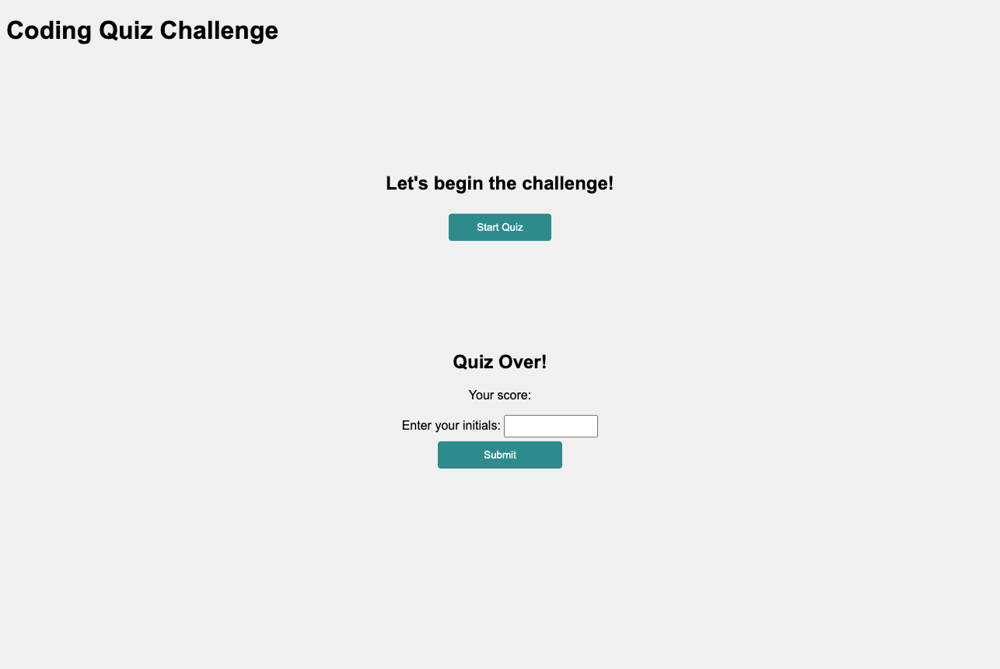
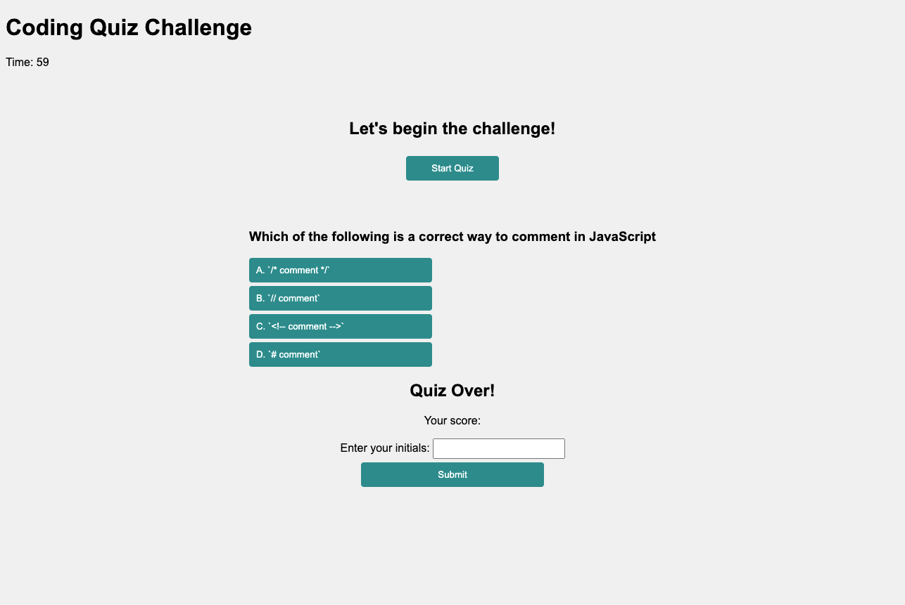

# JavaScript Coding Quiz

## Description

This is a simple browser-based quiz application focused on testing users' knowledge of JavaScript fundamentals. The app features dynamically updated HTML and CSS powered by JavaScript code. It includes a clean, polished, and responsive user interface. Users, particularly coding boot camp students, can take a timed quiz and store their high scores to gauge their progress compared to their peers.

## Usage

You can open the app in your browser with the url: https://gtorresv.github.io/js-quiz/. To start the quiz you can click on "Start Quiz" button. Answer each of the multiple-choice questions presented. If an answer is incorrect, the time will be subtracted from the clock by five seconds. The quiz ends when all the questions are answered or the timer reaches 0. After the quiz, you can save your initials and score will be displayed. 

Screenshots of Web App:

## Credits

N/A

## License

More information of the MIT License can be accessed through the repository. 
